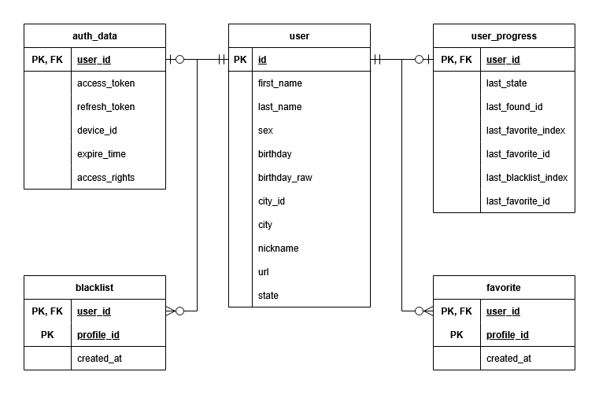

# 💘 VKinder - VK Dating Bot

<div align="center">


**Бот для знакомств ВКонтакте с удобным интерфейсом и логированием**

[Особенности](#-особенности) • [Установка](#-установка) • [Использование](#-использование) • [Структура](#-структура-проекта)

</div>

---

## 📋 Описание

VKinder — это интеллектуальный бот для ВКонтакте, который помогает находить новые знакомства на основе ваших предпочтений. Бот автоматически подбирает анкеты пользователей противоположного пола, находящихся онлайн.

## ✨ Особенности

- 🔍 **Умный поиск** — автоматический подбор анкет по полу пользователя
- 🎯 **Фильтрация** — показывает только пользователей с фото и находящихся онлайн
- ⚡ **Быстрая навигация** — удобное переключение между анкетами
- 💾 **Избранное** — возможность сохранять понравившиеся профили в список избранного
- 📊 **Детальное логирование** — полная история работы бота с цветными логами
- 🎨 **Красивый интерфейс** — интерактивная клавиатура с эмодзи

## 🚀 Быстрый старт

### Предварительные требования

- Python 3.12 или выше
- Git
- СУБД с развёрнутой базой данных (например, PostgreSQL)
- Аккаунт ВКонтакте
- Подключение к интернету

### 📥 Установка

1. **Клонируйте репозиторий:**

   ```bash
   git clone https://github.com/andrey0722/vkinder-vk-bot.git
   cd vkinder-vk-bot
   ```

2. **Создайте виртуальное окружение:**

   ```bash
   python -m venv venv
   ```

3. **Активируйте виртуальное окружение:**

   Windows:

   ```bat
   venv\Scripts\activate
   ```

   Linux/macOS:

   ```bash
   source venv/bin/activate
   ```

4. **Установите зависимости:**

   Можно использовать различные пакетные менеджеры для установки
   зависимостей, например, `pip`, `poetry`, `uv` и другие:

   ```bash
   pip install .
   ```

   ```bash
   uv sync
   ```

   ```bash
   poetry install
   ```

### Получение ключей доступа VK

#### Получение ключа доступа сообщества VK

Бот должен работать от имени сообщества, поэтому необходимо его создать, либо
использовать уже имеющееся сообщество.

1. Перейдите на страницу [Сообщества VK](https://vk.com/groups)
2. Нажмите кнопку "Создать сообщество"
3. Введите название сообщества и его тематику и подтвердить
4. Нажмите "Перейти в сообщество"
5. Нажмите "Управление" на правой панели
6. Перейдите в раздел "Сообщения -> Настройки для бота"
7. Переключите "Возможности ботов" в значение "Включены"
8. Нажмите "Сохранить"
9. Перейдите в раздел "Дополнительно -> Работа с API -> Ключи доступа"
10. Нажмите "Создать ключ"
11. Выберите все права доступа для ключа
12. Нажмите "Создать"
13. При необходимости подтвердите операцию с помощью второго фактора
14. В текстовом поле появится ключ доступа сообщества, сохраните его себе

> ⚠️ **Внимание:** Никогда не публикуйте ключ доступа сообщества в открытом доступе!

#### Получение ключа доступа пользователя VK

1. Перейдите на страницу [VK для разработчиков | Приложения](https://dev.vk.com/ru/admin/apps-list)
2. Нажмите "Создать приложение +"
3. Выберите тип приложения "Мини-приложение", любую категорию и введите любое название
4. Нажмите "Создать"
5. При необходимости подтвердите операцию с помощью второго фактора
6. Мини-приложение создано, на панели справа находится поле "ID" с идентификатором
   мини-приложения, сохраните его себе
7. Откройте в браузере ссылку следующего вида:

   ```text
   https://oauth.vk.com/authorize?client_id=123456&redirect_uri=https://oauth.vk.com/blank.html&response_type=token
   ```

   где в качестве `client_id` необходимо указать ID мини-приложения, полученное на шаге №6

8. При необходимости дайте разрешение своему мини-приложению
9.  При успешном варианте развития событий откроется страница со следующим текстом:

   ```text
   Пожалуйста, не копируйте данные из адресной строки для сторонних сайтов. Таким образом Вы можете потерять доступ к Вашему аккаунту.
   ```

   Обратите внимание на текущий адрес в адресной строке, там будет адрес следующего вида:

   ```text
   https://oauth.vk.com/blank.html#access_token=vk1.a.VK_EXAMPLE_TOKEN&expires_in=86400&user_id=123456
   ```

   Здесь параметр `access_token` содержит ключ доступа пользователя, который VK создал
   и передал нашему мини-приложению. Параметр `expires_in` содержит время жизни данного ключа
   в секундах с момента его создания.

> ⚠️ **Внимание:** Никогда не публикуйте ключ доступа пользователя в открытом доступе!

### 🔑 Настройка окружения

1. **Создайте файл `.env` в корне проекта:**

   Бот представляет собой утилиту командной строки без параметров.
   Взамен, бот имеет конфигурационные параметры, которые можно
   задать с помощью переменных окружения либо файла `.env` в
   корневой папке проекта.

   Для удобства работы с файлом `.env` предусмотрен файл `.env.example`,
   который является шаблоном для файла `.env` и содержит подробное
   описание параметров программы.

   Инициализировать файл `.env` можно следующей командой:

   Windows:

   ```cmd
   copy /Y .env.example .env
   ```

   Linux/macOS:

   ```bash
   cp -f .env.example .env
   ```

2. **Отредактируйте содержимое `.env`:**

   Общая структура файла `.env`, теперь необходимо заполнить значения параметров
   собственными значениями, полученными на предыдущих шагах.

   #### Конфигурационные параметры

   - `VK_COMMUNITY_TOKEN` - ключ доступа сообщества для использования методов VK API.
   - `VK_USER_TOKEN` - ключ доступа пользователя для использования некоторых отдельных методов VK API.
   - `CLEAR_DATA` - позволяет полностью очистить базу данных при запуске.
     Для этого следует установить параметр в значение `True`.
     По умолчанию - `False`.
   - `DB_DRIVER` - название драйвера и диалект для подключения к базе данных.
     По умолчанию - `postgresql+psycopg2`.
   - `DB_HOST` - имя узла сети либо IP-адрес, где развёрнута база данных.
     По умолчанию - `localhost`.
   - `DB_PORT` - номер порта для подключения к базу данных. По умолчанию - `5432`.
   - `DB_NAME` - название существующей базы данных, к которой осуществить подключение.
     По умолчанию - `vkinder_vk_bot`.
   - `DB_USER` - имя пользователя, который имеет права на создание и изменение таблиц в
     базе данных. По умолчанию - `postgres`.
   - `DB_PASS` - пароль пользователя для аутентификации в базе данных.
     По умолчанию - `postgres`.

### ▶️ Запуск

```bash
python src/main.py
```

## 🎮 Использование

После запуска бота отправьте ему сообщение **"Начать"** или **"Привет"** в личные сообщения группы.

### Доступные команды

| Кнопка                         | Описание                           |
| ------------------------------ | --------------------------------   |
| 🔍 **Поиск**                    | Начать просмотр анкет             |
| ⏭️ **Следующая анкета**         | Показать следующую анкету         |
| ⏭️ **Предыдущая анкета**        | Показать предыдущую анкету        |
| 💘 **Добавить в избранное**     | Сохранить анкету в избранное      |
| ❌ **Удалить из избранного**    | Убрать анкету из избранного       |
| 💘 **🚫 Добавить в чёрный список**  | Добавить анкету в чёрный список |
| 💘 **❌ Удалить из чёрного списка** | Убрать анкету из чёрного списка |
| 🏁 **Вернуться в главное меню** | Вернуться к основному меню        |
| 💘 **Избранное**                | Посмотреть свой список избранного |
| 👤 **Профиль**                  | Посмотреть свою анкету            |
| ❓ **Помощь**                   | Показать справку                  |

### Пример работы

```text
Пользователь: Начать
Бот: Выбери действие: [Показывает клавиатуру]

Пользователь: 🔍 Поиск
Бот: Анкета пользователя:
     Имя: Иван
     Фамилия: Петров
     Ник: Не указано
     Пол: Мужской
     Дата рождения: 15.03.1995
     Возраст: 25
     Город: Москва
     ID: 6849721
     Ссылка: https://vk.com/id6849721
     Сейчас в сети: Да
```

## 📁 Структура проекта

```text
.
├── .env.example                    # Шаблон для файла .env
├── .gitignore
├── .idea
│   └── runConfigurations           # Конфигурации запуска для PyCharm
│       ├── Current_file.xml
│       └── Main.xml
├── db_diagram.png                  # ERD-диаграмма базы данных
├── LICENSE                         # Файл лицензии
├── logging.json                    # Настройки логирования
├── pyproject.toml                  # Файл проекта с зависимостями
├── README.md                       # README проекта
├── src
│   ├── main.py                     # Точка входа программы
│   └── vkinder                     # Главный пакет программы
│       ├── application.py          # Класс верхнего уровня
│       ├── config.py               # Загрузка внешних параметров окружения
│       ├── controller
│       │   ├── controller.py       # Класс контроллера MVC
│       │   ├── __init__.py
│       │   └── vk_service.py       # Взаимодействие с VK API
│       ├── exceptions.py
│       ├── __init__.py
│       ├── log.py                  # Функции для настройки логирования
│       ├── main.py                 # Точка входа пакета
│       ├── model                   # Классы модели MVC
│       │   ├── db.py               # Подключение к БД и сессия ORM
│       │   ├── exceptions.py
│       │   ├── __init__.py
│       │   ├── log.py              # Настройка логирования SQLAlchemy
│       │   ├── states
│       │   │   ├── favorite_list.py   # Просмотр списка избранного
│       │   │   ├── __init__.py
│       │   │   ├── main_menu.py          # Команды главного меню
│       │   │   ├── new_user.py           # Приветствие нового пользователя
│       │   │   ├── profile_provider.py   # Абстракция для VK API
│       │   │   ├── searching.py          # Поиск анкет
│       │   │   ├── state_manager.py      # Конечный автомат для ответа пользователю
│       │   │   └── state.py              # Базовый класс всех состояний автомата
│       │   └── types.py                  # Описание типов данных ORM
│       ├── shared_types.py      # Общие типы данных для разных компонентов
│       └── view                 # Функции вида MVC
│           ├── format.py        # Форматирование ответов в строки
│           ├── __init__.py
│           ├── menu.py          # Локализация и нормализация команд меню
│           ├── message.py       # Подготовка сообщения перед отправкой
│           └── strings.py       # Хранение локализованных строк
└── .vscode
    └── launch.json              # Конфигурации запуска для VSCode
```

## 💽 База данных

Данные бота сохраняются и извлекаются из базы данных. База данных устроена
согласно следующей диаграмме:



Данные сущности описаны с помощью ORM-отображений в модуле `src/vkinder/model/types.py`.

### Сущности БД

- **user** - хранит личные данные пользователя бота и его ID.
- **user_progress** - хранит промежуточную информацию для состояний бота, состоящих из нескольких фаз.
- **favorite** - список избранных анкет для каждого пользователя бота.
- **blacklist** - список заблокированных анкет для каждого пользователя бота.

## 🛠️ Технологии

- **Python 3.12+** — основной язык программирования
- **vk_api** — библиотека для работы с VK API
- **dotenv + pydantic-settings** — управление переменными окружения
- **coloredlogs + pygments** — цветное логирование
- **sqlalchemy + psycopg2-binary** — работа с БД

## 📊 Логирование

Бот ведет детальное логирование всех операций:

- ℹ️ Информационные сообщения (белый)
- ❌ Ошибки (красный)
- ⚠️ Предупреждения (желтый)
- 🧪 Отладочные сообщения (зеленый)

Логи сохраняются в файл `vkinder.log` и выводятся в консоль.

## 🔧 Конфигурация

### Параметры поиска

В файле `src/vkinder/model/states/searching.py` можно настроить параметры поиска:

```python
SEARCH_AGE_MAX_GAP = 1
"""Maximum age gap to use in profile search."""

SEARCH_SEX_MAP: Final[dict[Sex, Sex]] = {
    Sex.FEMALE: Sex.MALE,
    Sex.MALE: Sex.FEMALE,
}
"""Mapping for sex selection in search query."""

FILTER_BY_SEX: bool = True
"""Filer users by sex value. If `False` then no filtering."""

FILTER_BY_CITY: bool = True
"""Filer users by sex value. If `False` then no filtering."""

FILTER_BY_AGE: bool = True
"""Filer users by age value. If `False` then no filtering."""

FILTER_ONLINE: bool | None = True
"""Filer users by online property value. If `None` then no filtering."""

FILTER_HAS_PHOTO: bool | None = True
"""Filer users by photo availability. If `None` then no filtering."""
```

## 🐛 Устранение неполадок

### Бот не отвечает

- Проверьте, что Long Poll включен в настройках группы
- Убедитесь, что боту разрешены входящие сообщения

### Ошибка доступа к API

- Проверьте актуальность токенов
- Убедитесь, что у токена пользователя есть права на поиск

## 📝 TODO

- [x] Использование клавиатуры бота
- [x] Базовый поиск анкет (возраст, пол, город)
- [x] Вывод результатов поиска пользователю
- [x] Извлечение фотографий пользователя и отправка в виде attachment
- [x] Поддержка списка избранных анкет для каждого пользователя
- [x] Поддержка чёрного списка анкет для каждого пользователя
- [x] Расширение поисковой выдачи свыше 1000 анкет перед фильтрацией
- [ ] Расширенные фильтры поиска (увлечения, общие группы, друзья)
- [ ] История просмотра анкет
- [ ] Статистика использования бота
- [ ] Персональные настройки для каждого пользователя

## 🤝 Вклад в проект

Если вы хотите внести свой вклад:

1. Сделайте fork репозитория
2. Создайте ветку для новой функции (`git checkout -b feature/amazing-feature`)
3. Сделайте commit изменения (`git commit -m 'Add amazing feature'`)
4. Сделайте push ветки (`git push origin feature/amazing-feature`)
5. Откройте Pull Request

## 📄 Лицензия

Данный проект распространяется в рамках лицензии MIT.

## 👤 Авторы

- [**endless-0x01**](https://github.com/endless-0x01)
- [**andrey0722**](https://github.com/andrey0722)
- [**VladPrickly**](https://github.com/VladPrickly)

## 🙏 Благодарности

- [vk_api](https://github.com/python273/vk_api) — отличная библиотека для работы с VK API
- Сообщество разработчиков ВКонтакте

---

<div align="center">

**Сделано с ❤️ для изучения Python и VK API**

⭐ Поставьте звезду, если проект был полезен!

</div>

